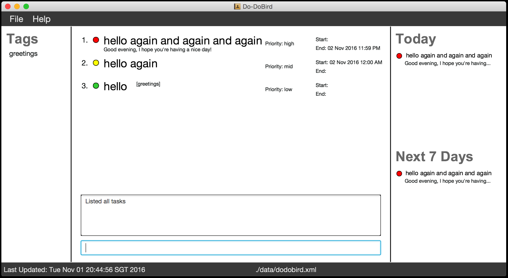
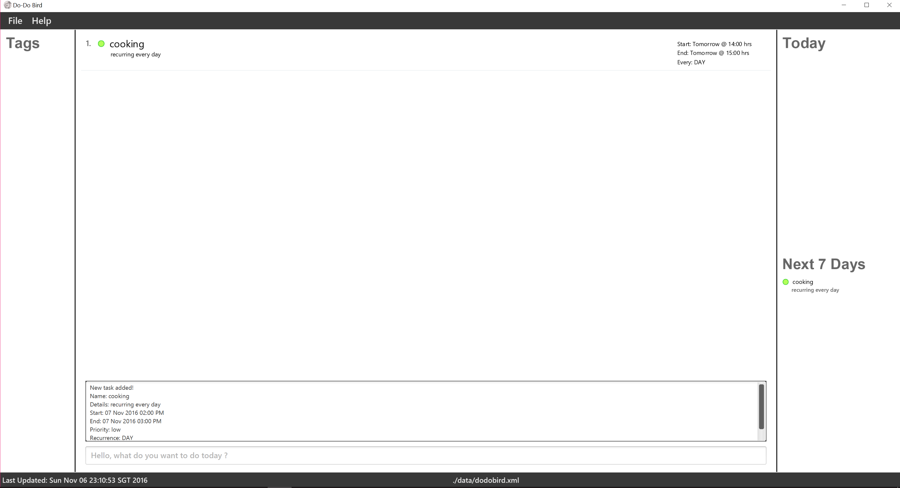
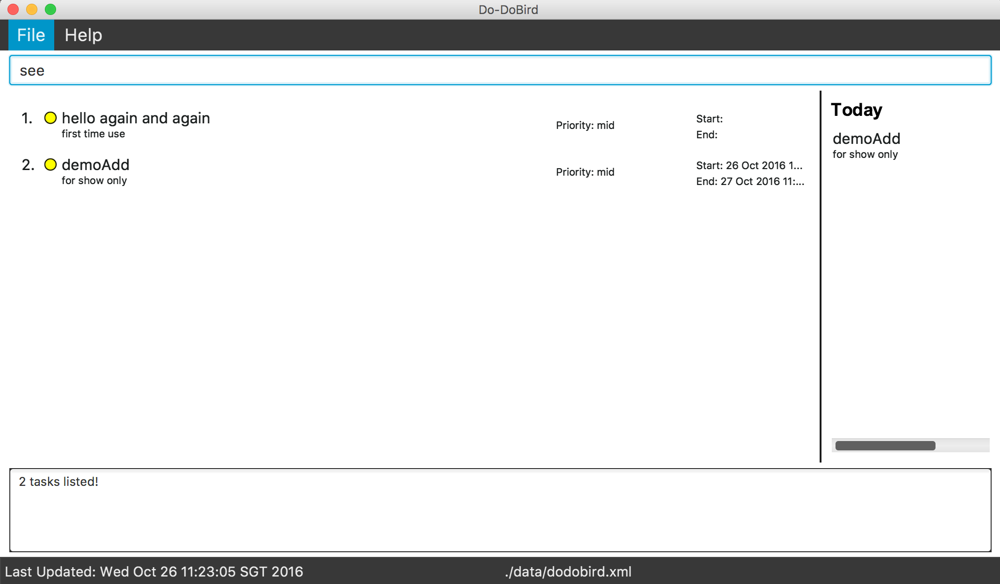
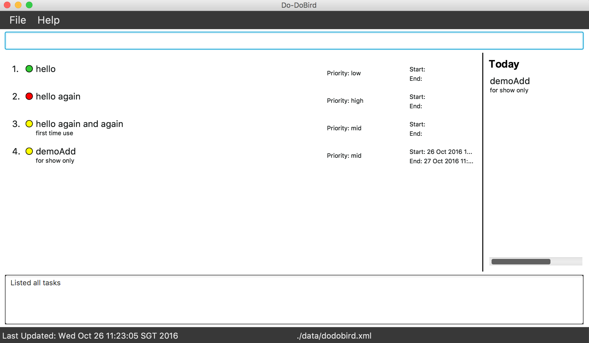
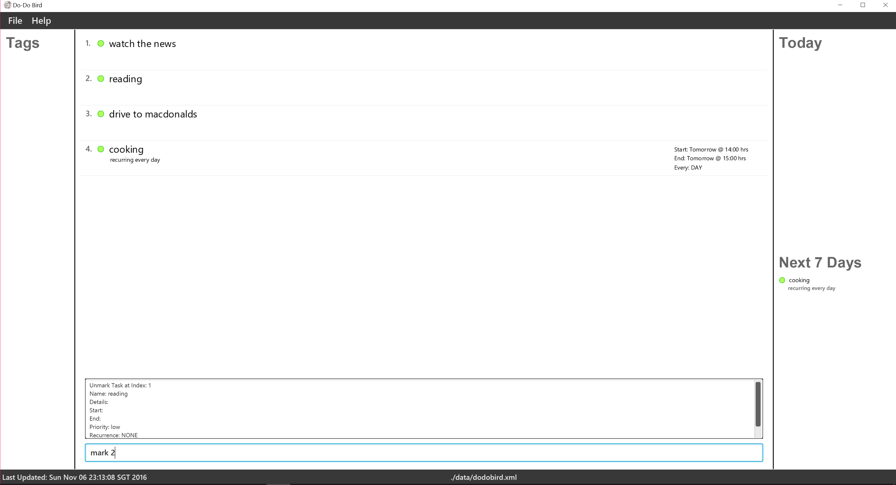
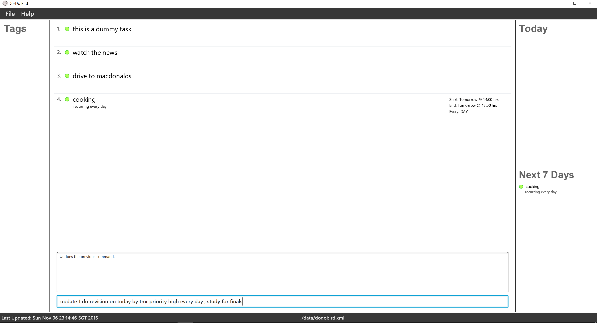
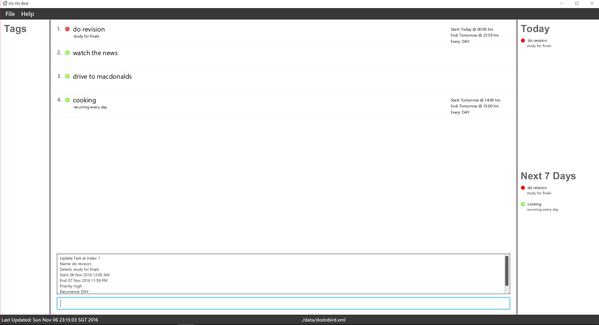
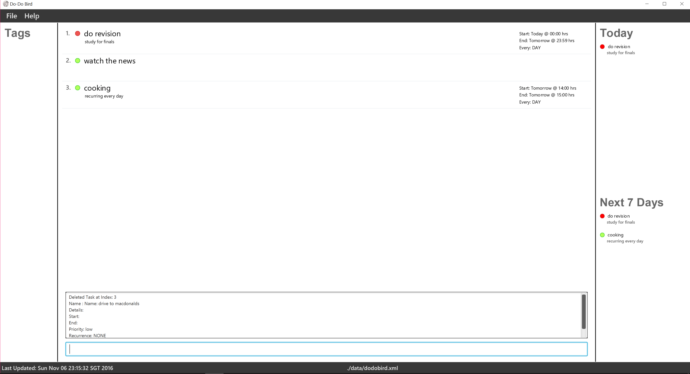

	# User Guide

* [Quick Start](#quick-start)
* [Features](#features)
* [FAQ](#faq)
* [Command Summary](#command-summary)

## Quick Start

0. Ensure you have Java version `1.8.0_60` or later installed in your Computer. 
   > Having any Java 8 version is not enough.  
   This app will not work with earlier versions of Java 8.

1. Download the latest `Do-Do Bird.jar` from the [releases](../../../releases) tab.
2. Copy the file to the folder you want to use as the home folder for your Do-Do Bird application.
3. Double-click the file to start the app. The GUI should appear in a few seconds.
   > 

4. Type the command in the command box and press <kbd>Enter</kbd> to execute it.  
   e.g. typing **`help`** and pressing <kbd>Enter</kbd> will open the help window.
5. Some example commands you can try:
   * **`see`**` tomorrow`:  see all tasks for tomorrow.
   * **`add`**` Meet with professor; CS1234; from 10/10/17 09:30; till 17:00;` :
     adds a task named `Meet with Professor` to the tasks list.
   * **`delete`**` 3` : deletes the task with ID #3.
   * **`exit`** : exits the app.
6. Refer to the [Features](#features) section below for details of each command. 

# Features

> **Command Format**
> * Items in `SQUARE_BRACKETS` are optional.
> * Items with `...` after them can have multiple instances.
> * The order of parameters is fixed.

> **Date and Time Format**
> * **Date**
>   * 25/10/2017 or 25-10-2017
>   * 25 Oct 2017
>   * 25 October 2017
>   * tomorrow/yesterday/today/next monday
> * **Time**
>   * 24-hours format : 09:30
>   * 12-hours format : 09:30pm

## Viewing help : `help`
Shows the help page to user. 

Format: `help`

> Help is also shown if you enter an incorrect command e.g. `abcd`

## Adding a task: `add`
Adds a task to Do-Do Bird. 

Format:

* `add TASK_NAME [; a line of details]`
* `add TASK_NAME by DATE [TIME] [; a line of details]`
* `add TASK_NAME on DATE [TIME] [; a line of details]`
* `add TASK_NAME on DATE [TIME] by DATE [Time] [; a line of details]`

> Date and Time formats follow the above guidelines.

Examples:

* **`add`**` Meet with professor ; consultation for mid-terms`
* **`add`**` CS1010 Lab 4 by 10/10/2017`
* **`add`**` Amy's weddings on 25/10/17;`
* **`add`**` demoAdd on today by tomorrow priority mid ; for show only`

Demo:

Type the command

Display result

## Seeing tasks : `see`
Shows a list of all tasks in Do-Do Bird. 

Format: `see`

Demo:

Type the command

Display result

## Searching tasks: `search`
Search tasks whose names or details contain any of the given keywords.  
Search for tasks before/after a time. 
Search for tasks on a particular date. 
Search for tasks with the specified tag. 
Search for tasks that are done or not done. 

Format:

* `search KEYWORD [MORE_KEYWORDS]`
* `search before DATE [TIME]`
* `search after DATE [TIME]`
* `search on DATE [TIME]`
* `search from DATE [TIME] till DATE [TIME]`
* `search tag TAG`
* `search done`
* `search undone`

Examples:
* **`search`**` Party fun NIgHt OUTzz`
* **`search`**` before 25/10/17 t09:30`
* **`search`**` tag birthdays`
* **`search`**` HeLlO`

> * The search is case insensitive. e.g `meeting` will match `Meeting`.
> * The order of the keywords does not matter. e.g. `Meet Professor` will match `Professor Meet`
> * Tasks matching at least one keyword will be returned (i.e. `OR` search).
    e.g. `Meeting` will match `Meeting Professor`

Demo:

Type the command

Display result

## Marking tasks as done : `mark`
Marking a task in Do-Do Bird as completed. 

Format: `mark ID`

> The ID must be a positive integer 1, 2, 3, ...

Examples:

* **`search`**` ` 
  **`mark`**` 2` 
  Mark the task with `ID #2` in the Do-Do Bird as completed.

## Unmarking tasks : `unmark`
Unmark a task in Do-Do Bird to be uncompleted. 

Format: `unmark ID`

> The ID must be a positive integer 1, 2, 3, ...

Examples:

* **`search`**` HeLlO` 
**`unmark`**` 2` 
Mark the task with `ID #2` in the Do-Do Bird as uncompleted.

Demo:

Type the `search` command

Display search result

Type the `mark` command

Display mark result

## Updating a task: `update`
Update an existing task inside Do-Do Bird. 

Format:

* `update ID [NEW_NAME] on [DATE [Time]] by [DATE [Time]] [; a line of new details]`

> * Date and Time formats follow the above guidelines.
> * To remove an optional field, input `-` as the parameter
> * The ID must be a positive integer 1, 2, 3, ...
> * To remove any pre-existing optional fields, prefix a `-` to the field specifier.

Examples:

* **`search`**` tomorrow` 
  **`update`**` 2 on 14/10/17 by 18/10/17;`  
  Update the task with `ID #2` to reflect new dates/
* **`search`**` hello` 
  **`update`**`  1 hello haha on Oct 29 1600 by mon priority mid ; changed everything`  
  Update the task with `ID #3` to remove old on date.

Demo:

Type the `search` command

Display search result

Type the `update` command

Display mark result

## Deleting a task : `delete`
Deletes the specified task from the Do-Do Bird. 

Format: `delete ID`

> The ID **must be a positive integer** 1, 2, 3, ...

Examples:

* **`search`**` Tutorial` 
  **`delete`**` 1` 
  Deletes the task with `ID #1` in the Do-Do Bird.
  
Demo:

Type the `search` command

Display search result

Type the `delete` command

Display delete result

## Tagging a task : `tag`
Tags the specified task with the specified tag. 

Format: `tag ID TAG`

> The ID **must be a positive integer** 1, 2, 3, ...

Examples:

* **`see`**  
**`tag`**` 2 Tutorial` 
Tags the task with `ID #2` with `Homework` tag

## Untagging a task : `untag`
Untags the specified task from the specified tag. 

Format: `untag ID TAG`

> The ID **must be a positive integer** 1, 2, 3, ...

Examples:

* **`see`**  
**`untag`**` 2 Tutorial` 
Untags the task with `ID #2` from `Homework` tag

## Storing : `store`
Change the storage location for the data file. 

Format: `store location`

## Undoing : `undo`
Undo the last operation. 

Format: `undo`

## Resetting : `reset`
Resets user's config to default. 

Format: `reset`

## Clearing all entries : `clear`
Clears all entries from the Do-Do Bird. 

Format: `clear`  

## Exiting the program : `exit`
Exits the program. 

Format: `exit`  

#### Saving the data
To-do list data are saved in the hard disk automatically after any command that changes the data. 
There is no need to save manually.

## FAQ

**Q**: How do I transfer my data to another Computer? 
**A**: Install the app in the other computer and overwrite the empty data file it creates with
       the file that contains the data of your previous Do-Do Bird folder.

## Command Summary

Command | Format  
-------- | :--------
Add | `add TASKNAME`
	| Example: add hello
	| `add TASKNAME priority PRIORITY`	
	| Example: add hello priority high/mid/low
	| `add TASKNAME ; DETAILS`	
	| Example: add hello ; first time use
	| `add TASKNAME on/from DATE`	                                              
	| Example: add hello on/from today/tomorrow/next wed/19:00/05:00pm/sunday 12:34am/Oct 20/every sat
	| `add TASKNAME by/to DATE`	
	| Example: add hello by/to today/tomorrow/next wed/19:00/05:00pm/sunday 12:34am/Oct 20/every sat
	| `add TASKNAME on/from DATE by/to DATE`
	| Example: add hello on/from today/tomorrow/next wed/19:00/05:00pm by/to sunday 12:34am/Oct 20/every sat
	| `add TASKNAME on/from DATE by/to DATE priority PRIORITY`
	| Example: add hello on/from today/tomorrow/next wed/19:00/05:00pm by/to sunday 12:34am/Oct 20/every sat priority high/mid/low
	| `add TASKNAME on/from DATE by/to DATE priority PRIORITY ; DETAILS`
	| Example: add hello on/from today/tomorrow/next wed/19:00/05:00pm by/to sunday 12:34am/Oct 20/every sat priority high/mid/low ; first time use
Clear | `clear`
Delete | `delete ID`	
	   | Example: delete 12
Help | `help`
Mark | `mark ID`	
	 | Example: mark 12
Unmark | `unmark ID`	
       | Example: mark 12
Quitting | `exit`
Search | `search KEYWORDS` 	
	   | Example: search hello/project Meeting/PrOjecT MeeTinG
	   | `search before DATE`	
	   | Example: search before today/tomorrow/next wed/19:00/05:00pm/sunday 12:34am/Oct 20/every sat
	   | `search after DATE`
	   | Example: search before today/tomorrow/next wed/19:00/05:00pm/sunday 12:34am/Oct 20/every sat
	   | `search priority PRIORITY`	
	   | Example: search priority high/mid/low
	   | `search tag TAG`	
	   | Example: search tag study   
See | `see`
Tag | `tag ID TAG`	
    | Example: tag 12 study
Untag | `untag ID TAG`	
      | Example: untag 12 study
Undo | `undo`
Update | `update ID TASKNAME`	
       | Example: update 10 hello again
	   | `update ID on/from DATE`	
	   |Example: update 10 on/from tmr 07:00pm/sunday 12:34am/Oct 20/every sat
	   | `update ID by/to DATE`	
	   | Example: update 10 by/to tmr 07:00pm/sunday 12:34am/Oct 20/every sat
	   | `update ID TASKNAME on/from DATE`	
	   | Example: update 10 hello again on/from tmr 07:00pm/sunday 12:34am/Oct 20/every sat
	   | `update ID TASKNAME by/to DATE`	
	   | Example: update 10 hello again by/to tmr 07:00pm/sunday 12:34am/Oct 20/every sat
	   | `update ID on/from DATE by/to DATE`	
	   | Example: update 10 on/from today/tomorrow/next wed/19:00/05:00pm by/to sunday 12:34am/Oct 20/every sat
	   | `update ID TASKNAME on/from DATE by/to DATE`
	   | Example: update 10 hello again on/from today/tomorrow/next wed/19:00/05:00pm by/to sunday 12:34am/Oct 20/every sat
	   | `update ID TASKNAME on/from DATE by/to DATE priority PRIORITY`
	   | Example: update 10 hello again on/from today/tomorrow/next wed/19:00/05:00pm by/to sunday 12:34am/Oct 20/every sat priority high/mid/low
	   | `update ID TASKNAME on/from DATE by/to DATE priority PRIORITY ; DETAILS`
	   | Example: update 10 hello again on/from today/tomorrow/next wed/19:00/05:00pm by/to sunday 12:34am/Oct 20/every sat priority high/mid/low ; again and again
